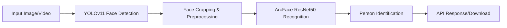

# 🎯 Face Recognition API: YOLOv11 + ArcFace ResNet50

[](https://python.org)
[](https://pytorch.org)
[](https://docker.com)
[](http://localhost:8000)
[](http://localhost:8501)
[](LICENSE)

Advanced Face Detection and Recognition API that combines **YOLOv11** for face detection and **ArcFace ResNet50** for face recognition, achieving **99.60%** accuracy on a dataset with 31 individuals.

> **⏰ Development Note:** This project was developed in 4-5 days as a proof-of-concept. There is still significant room for improvement, especially in unknown person detection and real-time streaming capabilities.

## 🏆 Key Achievements

- **🎯 Detection Rate:** 99.8% face detection success rate
- **🧠 Recognition Accuracy:** 99.60% validation accuracy 
- **⚡ Ultra-Fast Training:** Converged in 11 epochs (11.3 minutes)
- **🚀 Production Ready:** RESTful API + Docker deployment
- **📱 Interactive Demo:** Streamlit web interface
- **🎬 Multi-format Support:** Images (JPG, PNG, BMP) and Videos (MP4, AVI, MOV, MKV)

## 📊 Model Benchmark Results

Results from benchmarking 6 deep learning models for face recognition:

| Rank | Model | Best Val Acc | Final Val Acc | Training Time | Optimizer |
|------|-------|--------------|---------------|---------------|-----------|
| 🥇 | **ArcFace ResNet50** | **99.60%** | **99.40%** | 11.3 min | SGD |
| 🥈 | ConvNeXt-Base | 99.00% | 98.41% | 23.6 min | AdamW |
| 🥉 | YOLO-like EfficientNet | 98.61% | 95.02% | 6.7 min | AdamW |
| 4️⃣ | EfficientNet-B4 | 97.41% | 96.22% | 7.6 min | AdamW |
| 5️⃣ | ViT-Base | 89.24% | 76.10% | 5.1 min | AdamW |
| 6️⃣ | YOLOv11s | 17.53% | 2.59% | 4.9 min | Adam |

> **Winner:** ArcFace ResNet50 with specialized face recognition architecture achieved the best performance!

## 🎯 Features

- **🔍 Face Detection**: High-accuracy face detection using YOLOv11
- **🧠 Face Recognition**: Identity recognition using ArcFace ResNet50
- **📁 Multi-format Support**: Process images (JPG, PNG, BMP) and videos (MP4, AVI, MOV, MKV)
- **🌐 RESTful API**: Easy-to-use REST endpoints with comprehensive documentation
- **🐳 Docker Support**: Containerized deployment with GPU support
- **📱 Streamlit Interface**: Web-based interface for easy testing
- **🎬 Real-time Processing**: Stream video processing capabilities
- **⚡ GPU Acceleration**: NVIDIA GPU support for faster processing

## 🏗️ Architecture



**Two-Stage Pipeline:**
1. **Stage 1:** YOLOv11 for face detection (99.8% detection rate)
2. **Stage 2:** ArcFace ResNet50 for face recognition (99.60% accuracy)

## 🚀 Quick Start

### Prerequisites

- Docker and Docker Compose
- NVIDIA GPU (optional, for faster processing)
- NVIDIA Docker runtime (for GPU support)

### 1. Clone Repository
```bash
git clone https://github.com/ilhamdwiprastyo/yolov11-face-recognition.git
cd yolov11-face-recognition
```

### 2. Setup Model Files
```
models/
├── yolov11s-face.pt                    # Auto-downloaded if not present
├── arcface_resnet50_final_model.pth    # Your trained model
└── classes.txt                         # Class names (provided)
```

### 3. Build & Run with Docker Compose
```bash
# Build and start services
docker-compose up --build

# Or run in background
docker-compose up -d --build
```

### 4. Access Services
- **🔌 API Documentation:** http://localhost:8000/docs
- **📱 Streamlit Interface:** http://localhost:8501
- **💚 Health Check:** http://localhost:8000/api/v1/health

## 📡 API Endpoints

### Health Check
```http
GET /api/v1/health
```

### Image Processing
```http
POST /api/v1/detect/image
Content-Type: multipart/form-data

Parameters:
- file: Image file
- confidence_threshold: float (0.1-1.0, default: 0.5)
- processing_mode: "detect_only" | "recognize_only" | "detect_and_recognize"
```

### Video Processing
```http
POST /api/v1/detect/video
Content-Type: multipart/form-data

Parameters:
- file: Video file
- confidence_threshold: float (0.1-1.0, default: 0.5)
- processing_mode: "detect_only" | "recognize_only" | "detect_and_recognize"
- frame_skip: int (1-10, default: 1)
- max_frames: int (1-1000, default: 100)
```

### Download Results
```http
GET /api/v1/download/image/{image_id}
GET /api/v1/download/video/{video_id}
```

## 💻 Usage Examples

### Using cURL

```bash
# Health check
curl http://localhost:8000/api/v1/health

# Process image
curl -X POST \
  -F "file=@/path/to/image.jpg" \
  -F "confidence_threshold=0.5" \
  -F "processing_mode=detect_and_recognize" \
  http://localhost:8000/api/v1/detect/image

# Process video
curl -X POST \
  -F "file=@/path/to/video.mp4" \
  -F "confidence_threshold=0.5" \
  -F "processing_mode=detect_and_recognize" \
  -F "frame_skip=2" \
  -F "max_frames=50" \
  http://localhost:8000/api/v1/detect/video
```

### Using Python

```python
import requests

# Process image
def process_image(image_path):
    with open(image_path, 'rb') as f:
        files = {'file': f}
        data = {
            'confidence_threshold': 0.5,
            'processing_mode': 'detect_and_recognize'
        }
        response = requests.post('http://localhost:8000/api/v1/detect/image', 
                               files=files, data=data)
        result = response.json()
        print(f"Detected {result['faces_detected']} faces")
        return result

# Process video
def process_video(video_path):
    with open(video_path, 'rb') as f:
        files = {'file': f}
        data = {
            'confidence_threshold': 0.5,
            'processing_mode': 'detect_and_recognize',
            'frame_skip': 2,
            'max_frames': 100
        }
        response = requests.post('http://localhost:8000/api/v1/detect/video', 
                               files=files, data=data)
        return response.json()
```

## ⚙️ Configuration

### Environment Variables

| Variable | Description | Default |
|----------|-------------|---------|
| `API_HOST` | API host address | `0.0.0.0` |
| `API_PORT` | API port | `8000` |
| `DEBUG` | Debug mode | `False` |
| `DEVICE` | Processing device (`cuda`/`cpu`) | `cuda` |
| `DETECTION_CONFIDENCE` | Default confidence threshold | `0.5` |
| `MAX_FILE_SIZE` | Maximum upload file size | `50MB` |

### Model Configuration

```bash
# Copy environment template
cp .env.example .env

# Edit configuration
nano .env
```

## 📊 Performance Benchmarks

### Model Performance
- **Recognition Accuracy:** 99.60% (ArcFace ResNet50, for known classes)
- **Detection Success Rate:** 99.8% (YOLOv11)
- **Training Time:** 11.3 minutes (50 epochs, converged at epoch 11)
- **Model Size:** ~25MB total
- **Known Classes:** 31 individuals (unknown person detection needs improvement)

### Runtime Performance (RTX 3080)
- **Image Processing:** ~200ms per image (1920x1080)
- **Video Processing:** ~30 FPS (720p)
- **Memory Usage:** ~2GB GPU VRAM
- **Model Loading:** ~5 seconds

### Optimization Tips
1. Use GPU for faster processing
2. Adjust `frame_skip` for videos to balance speed vs accuracy
3. Lower `confidence_threshold` to detect more faces
4. Resize large images before processing

## ⚠️ Current Limitations & Known Issues

As a project developed within **4-5 days**, there are several limitations that need attention:

### 🎯 Recognition Limitations
- **Unknown Person Detection:** System is not optimal at detecting/rejecting people not in the training dataset
- **Limited Classes:** Currently only trained to recognize 31 individuals from the dataset
- **False Positives:** Unknown people sometimes get identified as one of the 31 trained classes
- **Confidence Calibration:** Confidence thresholds still need fine-tuning for better precision

### 🚀 Technical Limitations  
- **REST API Only:** Currently only supports synchronous REST API calls
- **No Real-time Streaming:** No support for WebSocket or Server-Sent Events (SSE) yet
- **Batch Processing:** Video processing is still sequential, not optimized for batch processing
- **Memory Management:** Large file processing can consume significant memory

### 📊 Performance Notes
- **Accuracy Trade-off:** 99.60% accuracy is valid for known classes, but unknown person detection is still weak
- **Dataset Scope:** Model is limited to characteristics of the dataset used (31 people, controlled conditions)
- **Generalization:** Not extensively tested on real-world scenarios with lighting/angle variations

## 🔮 Future Improvements & Roadmap

### 🎯 Accuracy Enhancements
- [ ] **Unknown Person Detection:** Implement proper rejection/unknown class handling
- [ ] **Confidence Calibration:** Better threshold tuning to minimize false positives
- [ ] **Data Augmentation:** More diverse training data for better generalization
- [ ] **Cross-validation:** More extensive testing on different datasets
- [ ] **Ensemble Methods:** Combine multiple models for better accuracy

### 🚀 API & Streaming Features
- [ ] **WebSocket Support:** Real-time face recognition streaming
- [ ] **Server-Sent Events (SSE):** Live video processing updates
- [ ] **Async Processing:** Non-blocking video processing with job queues
- [ ] **Batch API:** Process multiple images/videos in single request
- [ ] **Webhook Callbacks:** Notify external systems when processing is complete

### 🛠️ Technical Improvements
- [ ] **Model Optimization:** Quantization, pruning for faster inference
- [ ] **Edge Deployment:** Optimize for mobile/edge devices
- [ ] **Auto-scaling:** Kubernetes deployment with horizontal scaling
- [ ] **Monitoring & Metrics:** Comprehensive logging and performance monitoring
- [ ] **A/B Testing:** Framework for testing different model versions

### 📱 User Experience
- [ ] **Real-time Preview:** Live camera feed processing in Streamlit
- [ ] **Advanced UI:** Better visualization and controls
- [ ] **Mobile App:** React Native or Flutter companion app
- [ ] **Admin Dashboard:** Model management and analytics interface

## 🎮 Interactive Demo

Launch the Streamlit demo to test the system interactively:

1. Go to http://localhost:8501
2. Upload image or video using the file uploader
3. Adjust confidence threshold and processing mode
4. View real-time face detection and recognition results
5. Download processed files with bounding boxes

## 📋 Testing Resources

### Postman Collection
Import the provided Postman collection for easy API testing:
- **File:** `postman_collection.json`
- **Environment:** `postman_environment.json`

### Sample Files & Outputs
- **Input Samples:** `samples/` folder
- **Output Examples:** `outputs/` folder
- **Test Results:** Pre-processed examples with bounding boxes

## 🛠️ Manual Installation

For development without Docker:

### 1. Install Dependencies
```bash
# Create virtual environment
python -m venv face_recognition_env
source face_recognition_env/bin/activate  # Linux/Mac
# face_recognition_env\Scripts\activate  # Windows

# Install dependencies
pip install -r requirements.txt
```

### 2. Set Environment Variables
```bash
cp .env.example .env
# Edit .env file with your settings
```

### 3. Run Services
```bash
# Run API server
python server.py

# Run Streamlit (separate terminal)
cd streamlit_app
streamlit run app.py
```

## 📁 Project Structure

```
face-recognition-api/
├── app/                     # Main application
│   ├── dependencies/        # Dependency injection
│   ├── routers/            # API endpoints
│   ├── schemas/            # Pydantic models
│   ├── services/           # Business logic
│   └── utils/              # Utilities
├── config/                 # Configuration files
├── models/                 # Model files
│   ├── yolov11s-face.pt
│   ├── arcface_resnet50_final_model.pth
│   └── classes.txt
├── streamlit_app/          # Web interface
├── tests/                  # Unit tests
├── samples/                # Sample input files
├── outputs/                # Output examples
├── docker-compose.yml      # Docker configuration
└── requirements.txt        # Python dependencies
```

## 📖 Detailed Documentation

For complete documentation about methodology, experiments, and technical analysis:

📄 **[Complete Project Documentation](face_recognition_research.html)**
- Comprehensive technical report
- Detailed model comparisons
- Training configurations  
- Performance analysis
- Lessons learned

*Alternative: Download **Face Recognition Project - YOLOv11 + ArcFace ResNet50 Implementation.pdf** from the release page*

## 🧪 Development

### Running Tests
```bash
pytest tests/ -v
```

### Adding New Models
1. Implement model class in `app/utils/model_loader.py`
2. Add service class in `app/services/`
3. Update configuration and schemas as needed

## 🔧 Troubleshooting

### Common Issues

1. **CUDA out of memory**
   - Reduce batch size or image resolution
   - Set `DEVICE=cpu` for CPU processing

2. **Model not found**
   - Ensure model files are in `models/` directory
   - Check file permissions and download requirements

3. **API not responding**
   - Check if port 8000 is available
   - Verify Docker containers are running: `docker-compose ps`

4. **Slow processing**
   - Enable GPU acceleration
   - Adjust `frame_skip` for videos
   - Reduce image resolution

### Logs

Check logs for debugging:
```bash
# Docker logs
docker-compose logs api
docker-compose logs streamlit

# Local logs
tail -f logs/api.log
```

## 📈 Dataset Information

- **Source:** [Kaggle Face Recognition Dataset](https://www.kaggle.com/datasets/vasukipatel/face-recognition-dataset)
- **Total Images:** 2,562 images
- **Individuals:** 31 persons
- **Avg Images/Person:** 82.6
- **Dataset Split:** Train (69.4%) | Val (19.6%) | Test (10.9%)

## 🛡️ Use Cases

- **🏢 Access Control Systems:** Office building entry management
- **📱 Mobile Applications:** Personal photo organization
- **🎓 Educational Platforms:** Student attendance tracking
- **🛡️ Security Systems:** Surveillance and monitoring
- **🏥 Healthcare:** Patient identification systems
- **🎬 Media Processing:** Automatic face tagging in videos

## 🤝 Contributing

1. Fork the repository
2. Create feature branch (`git checkout -b feature/AmazingFeature`)
3. Make your changes
4. Add tests for new functionality
5. Ensure all tests pass: `pytest tests/ -v`
6. Commit changes (`git commit -m 'Add AmazingFeature'`)
7. Push to branch (`git push origin feature/AmazingFeature`)
8. Open Pull Request

## 📄 License

This project is licensed under the MIT License - see the [LICENSE](LICENSE) file for details.

## 🙏 Acknowledgments

- **YOLOv11 Face Detection:** [akanametov/yolo-face](https://github.com/akanametov/yolo-face)
- **Dataset:** [Kaggle Face Recognition Dataset](https://www.kaggle.com/datasets/vasukipatel/face-recognition-dataset)
- **ArcFace Implementation:** Based on original ArcFace paper
- **FastAPI:** Modern web framework for building APIs
- **Streamlit:** Interactive web app framework

## 📞 Support

For issues and questions:
- **GitHub Issues:** For bug reports and feature requests
- **API Documentation:** Available at `/docs` endpoint
- **Complete Documentation:** Technical report with detailed analysis
- **Demo:** Live demo available via Streamlit interface

---

**⭐ Star this repository if you find it helpful!**

*Built with ❤️ using PyTorch, FastAPI, and Docker*